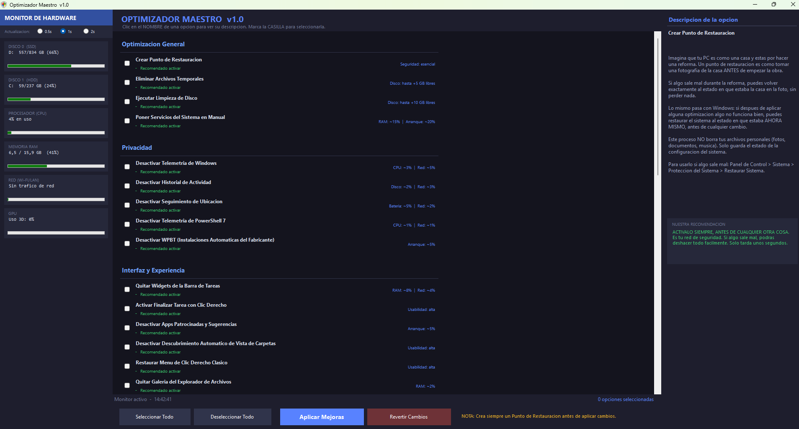

# ⚡ OptimizadorMaestro

> **Optimiza, limpia y protege tu Windows en minutos — sin necesidad de conocimientos técnicos.**


---

## ¿Qué es OptimizadorMaestro?

OptimizadorMaestro es una herramienta de escritorio para Windows que reúne en un solo lugar más de **35 optimizaciones** para mejorar el rendimiento, la privacidad y la experiencia de uso de tu PC. Cada ajuste viene con una explicación clara en español de qué hace, por qué importa y si deberías activarlo — ideal para usuarios que quieren sacarle el máximo partido a su equipo sin tener que ser expertos en informática.

Incluye un **monitor de sistema en tiempo real** (CPU, RAM, GPU, red y discos) para que veas el impacto de cada cambio al instante.

---

## ✨ Características principales

- **+35 optimizaciones organizadas por categoría**: Rendimiento, privacidad, interfaz, red, navegadores y opciones avanzadas.
- **Explicaciones en lenguaje cotidiano**: Cada ajuste explica qué hace usando ejemplos del mundo real. Sin tecnicismos innecesarios.
- **Monitor en tiempo real**: Visualiza el uso de CPU, RAM, GPU, red y todos tus discos mientras trabajas.
- **Recomendaciones por colores**: Verde (seguro y recomendado), Amarillo (evalúa según tu caso), Rojo (avanzado, úsalo con cuidado).
- **Punto de restauración integrado**: Crea un respaldo del sistema antes de aplicar cualquier cambio, con un solo clic.
- **EXE portable y autónomo**: No requiere instalación. Un solo archivo que funciona en cualquier PC con Windows 10/11.
- **Interfaz oscura y moderna**: Diseñada para ser cómoda a la vista y fácil de navegar.

---

## 🗂️ Categorías de optimización

| Categoría | Qué incluye |
|---|---|
| **Optimización General** | Punto de restauración, limpieza de archivos temporales y disco, servicios en manual |
| **Privacidad** | Desactivar telemetría de Windows y PowerShell, historial de actividad, rastreo de ubicación, WPBT |
| **Interfaz y Experiencia** | Menú clásico de clic derecho, quitar widgets, desactivar apps patrocinadas, mejoras al explorador |
| **Rendimiento** | Apps en segundo plano, pantalla en máximo rendimiento, hibernación, optimizaciones gráficas |
| **Red e Internet** | IPv4 preferido, Teredo, desactivar IPv6 |
| **Navegadores Web** | Optimizar Microsoft Edge y Brave Browser |
| **Opciones Avanzadas** | Desactivar Copilot, OneDrive, Xbox, Edge, Razer, Adobe, apps de la Tienda |

---

## 🎯 ¿Para quién es?

- **Usuarios domésticos** que quieren un PC más rápido sin entrar en configuraciones complicadas.
- **Gamers** que buscan reducir procesos en segundo plano y mejorar el rendimiento en juegos.
- **Personas que valoran su privacidad** y quieren reducir el envío de datos a Microsoft y terceros.
- **Técnicos y entusiastas** que hacen mantenimiento a equipos ajenos y necesitan una herramienta rápida y confiable.
- **Usuarios de equipos con pocos recursos** (4-8 GB de RAM) que necesitan liberar memoria y acelerar el arranque.

---

## ⚠️ Limitaciones

- Compatible únicamente con **Windows 10 y Windows 11** (64 bits).
- Requiere ejecutarse como **Administrador** para aplicar cambios al sistema (el propio programa lo solicita automáticamente).
- Actualmente el botón **"Aplicar Mejoras"** muestra una confirmación pero **aún no ejecuta los tweaks de forma real**. La lógica de cada ajuste está documentada en el código fuente (`Program.cs`, sección `OnApply()`) para que cualquier desarrollador pueda implementarla.
- No tiene soporte para Windows 7, 8 ni versiones ARM de Windows.
- No realiza cambios en el hardware ni en el BIOS.

---

## 🚀 Instalación y uso

### Opción A — Usar el EXE precompilado (recomendado)

> No necesitas instalar nada. Solo descarga y ejecuta.

1. Ve a la sección [**Releases**](https://github.com/DRVV77/OptimizadorMaestro/releases) de este repositorio.
2. Descarga el archivo `OptimizadorMaestro.exe`.
3. Haz **clic derecho** sobre el archivo → **Ejecutar como administrador**.
4. Si Windows muestra una advertencia de seguridad, haz clic en **"Más información" → "Ejecutar de todas formas"**.

> ✅ El EXE es completamente autónomo (~70 MB). Incluye el runtime de .NET 8 dentro. No necesitas instalar nada más.

---

### Opción B — Compilar desde el código fuente

Sigue estos pasos si quieres modificar el código o compilarlo tú mismo.

#### Requisitos previos

- Windows 10 u 11 (64 bits)
- [.NET 8 SDK](https://dotnet.microsoft.com/download/dotnet/8.0) — elige **".NET 8 SDK x64"**, **no** el Runtime
- Conexión a internet (solo la primera vez, para descargar paquetes NuGet)

#### Pasos

```bash
# 1. Clona el repositorio
git clone https://github.com/DRVV77/OptimizadorMaestro.git

# 2. Entra a la carpeta del proyecto
cd OptimizadorMaestro

# 3. Compila (o simplemente haz doble clic en COMPILAR.bat)
dotnet publish OptimizadorMaestro.csproj -c Release -r win-x64 --self-contained true -p:PublishSingleFile=true
```

O simplemente haz **doble clic en `COMPILAR.bat`** y espera 1-2 minutos. El EXE aparecerá en la misma carpeta.

---

## 🖼️ Capturas de pantalla



---

## 🤝 Contribuir

¿Quieres agregar un nuevo tweak, mejorar una explicación o implementar la lógica real de algún ajuste? ¡Las contribuciones son bienvenidas!

1. Haz un fork del repositorio
2. Crea una rama: `git checkout -b mi-mejora`
3. Realiza tus cambios y haz commit: `git commit -m "Agrega tweak de..."`
4. Envía un pull request

---

## 📄 Licencia

Este proyecto está bajo la licencia MIT. Puedes usarlo, modificarlo y distribuirlo libremente.

---

<p align="center">Hecho con ☕ y ganas de que Windows funcione como debería.</p>
